# 羽毛球视频智能剪辑系统 — 概要设计

> 项目名称：基于深度学习的羽毛球比赛视频智能剪辑系统
> 文档版本：v1.0
> 编写日期：2026-05-01

---

## 4. 系统部署设计

### 4.1 部署架构概述

本系统采用**单机集中式部署架构**，所有组件（Web服务器、深度学习推理引擎、数据库、文件存储）均部署在同一物理节点上。用户通过浏览器访问系统，后端基于 Flask 框架提供 HTTP 服务，集成 PyTorch I3D 3D卷积神经网络进行视频动作识别，并结合 YOLOv8 实现运动员与羽毛球检测，最终基于 FFmpeg 完成视频自动剪辑。

部署拓扑适用的典型场景包括：
- 本地个人工作站（Windows / Linux）
- 校内实验室服务器（无 GPU 加速时可运行 CPU 模式）
- 云端虚拟机（如腾讯云 CVM / 阿里云 ECS）

---

### 4.2 系统部署图

#### 4.2.1 PlantUML 代码

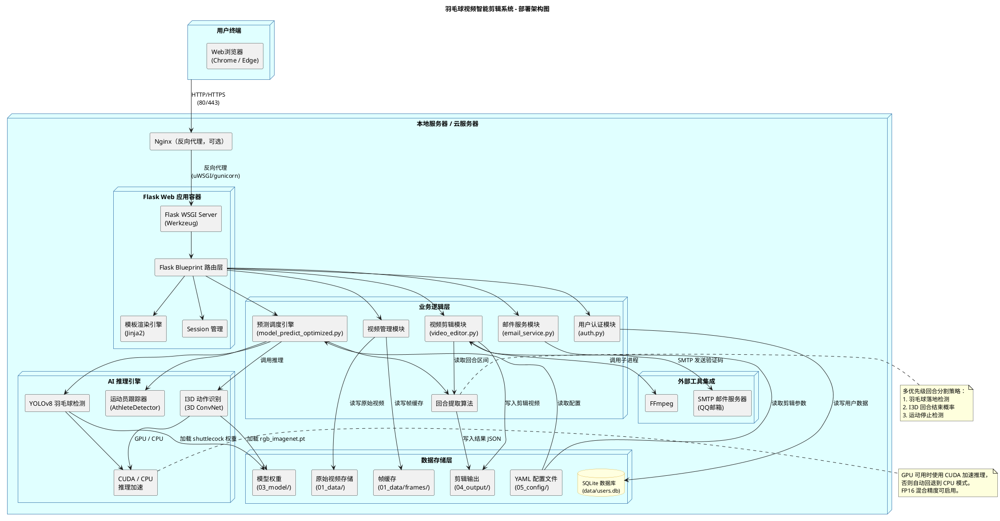

#### 4.2.2 Mermaid 代码

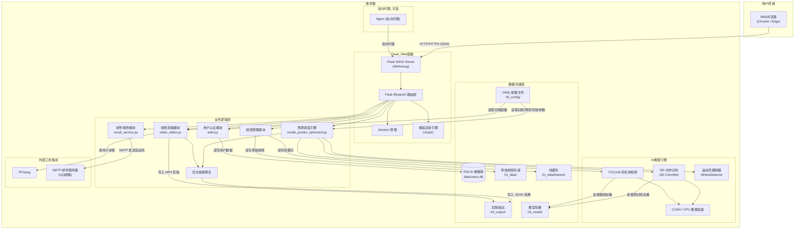

---

### 4.3 前后端分层架构图

#### 4.3.1 架构层次说明

系统采用经典的三层架构模式（表现层 — 业务逻辑层 — 数据层），层间职责明确、单向依赖，上层通过接口调用下层服务。

| 层级 | 职责 | 关键技术 |
|------|------|---------|
| **表现层 (UI / Presentation Layer)** | 用户交互界面，数据可视化 | HTML5, Tailwind CSS, Font Awesome, Axios |
| **业务逻辑层 (Business Logic Layer)** | 核心业务处理，流程编排 | Flask, PyTorch, I3D, YOLOv8 |
| **数据层 (Data Layer)** | 数据持久化与存取 | SQLite, 本地文件系统, YAML |

#### 4.3.2 PlantUML 代码

```plantuml
@startuml 羽毛球视频智能剪辑系统分层架构图
skinparam package {
  BackgroundColor LightGray
  BorderColor Black
  FontSize 14
  FontStyle Bold
}

skinparam component {
  BackgroundColor White
  BorderColor Gray
  FontSize 11
}

skinparam interface {
  BackgroundColor LightBlue
  BorderColor Blue
}

title 羽毛球视频智能剪辑系统 - 前后端分层架构图

' ========== 表现层 ==========
package "表现层 (Presentation Layer)" as PL #FFFACD {
  rectangle "📄 基础模板\nbase.html" as BaseTmpl
  rectangle "📄 上传页面\nupload.html" as UploadPage
  rectangle "📄 检测页面\ndetection.html" as DetectionPage
  rectangle "📄 播放器页面\nplayer.html" as PlayerPage
  rectangle "📄 登录页面\nlogin.html" as LoginPage
  rectangle "📄 注册页面\nregister.html" as RegisterPage
  rectangle "📄 密码重置\nforgot_password.html" as ForgotPwd
  rectangle "📄 管理后台\nadmin.html" as AdminPage
  rectangle "🎨 自定义样式\ncustom.css" as CustomCSS
  rectangle "⚡ Axios HTTP 客户端" as Axios
  rectangle "🔤 JavaScript 交互逻辑" as JS
}

' ========== 表现层-业务逻辑层接口 ==========
interface "RESTful API 接口" as RESTAPI

' ========== 业务逻辑层 ==========
package "业务逻辑层 (Business Logic Layer)" as BLL #E8F5E9 {
  rectangle "Web 路由控制器\nweb_app.py (Flask)" as WebApp
  rectangle "用户认证\n(auth.py)" as Auth
  rectangle "数据预处理\ndata_preprocess.py" as DataPreprocess
  rectangle "配置管理\nconfig_loader.py" as ConfigLoader

  rectangle "I3D 模型定义\ni3d.py" as I3DModel
  rectangle "模型训练\nmodel_train.py" as ModelTrain
  rectangle "标准预测\nmodel_predict.py" as ModelPredict
  rectangle "优化预测\nmodel_predict_optimized.py" as OptimizedPredict

  rectangle "运动员检测\nathlete_detector.py" as AthleteDetector
  rectangle "视频剪辑\nvideo_editor.py" as VideoEditor
  rectangle "邮件服务\nemail_service.py" as EmailService
  rectangle "标注辅助\nannotation_helper.py" as AnnotationHelper
}

' ========== 业务逻辑层-数据层接口 ==========
interface "数据访问接口 (DAO)" as DAO

' ========== 数据层 ==========
package "数据层 (Data Layer)" as DL #FFEBEE {
  rectangle "SQLite 数据库\n(data/users.db)\n用户表 / 日志表" as SQLite
  rectangle "原始视频存储\n01_data/raw_videos/" as RawVideos
  rectangle "帧缓存目录\n01_data/frames/" as Frames
  rectangle "预测结果 JSON\n04_output/*.json" as PredictJSON
  rectangle "剪辑输出 MP4\n04_output/clips/" as OutputMP4
  rectangle "YAML 配置存储\n05_config/*.yaml" as YAMLConfig
  rectangle "模型权重文件\n03_model/pretrained/\n03_model/trained/" as Models
}

' ========== 外部系统 ==========
package "外部系统集成" as External #E3F2FD {
  rectangle "FFmpeg 视频处理" as FFMPEG
  rectangle "QQ邮箱 SMTP 服务" as SMTP
  rectangle "PyTorch (CUDA/CPU)" as PyTorch
  rectangle "Ultralytics (YOLOv8)" as YOLO
}

' ========== 连接关系（表现层 -> 业务逻辑层）==========
BaseTmpl --> UploadPage : 继承
BaseTmpl --> DetectionPage : 继承
BaseTmpl --> PlayerPage : 继承
BaseTmpl --> LoginPage : 继承
BaseTmpl --> RegisterPage : 继承
BaseTmpl --> ForgotPwd : 继承
BaseTmpl --> AdminPage : 继承

UploadPage -right-> Axios : AJAX 上传
DetectionPage -right-> Axios : AJAX 轮询
PlayerPage -right-> Axios : AJAX 加载
LoginPage -right-> Axios : AJAX 登录
RegisterPage -right-> Axios : AJAX 注册
AdminPage -right-> Axios : AJAX 管理操作
CustomCSS --> UploadPage : 样式注入
CustomCSS --> DetectionPage : 样式注入
CustomCSS --> PlayerPage : 样式注入
JS --> Axios : 调用

Axios -up-> RESTAPI : HTTP 请求
RESTAPI -left-> WebApp : Flask 路由分发

' ========== 连接关系（业务逻辑层内部）==========
WebApp --> Auth : 登录/注册/鉴权
WebApp --> ConfigLoader : 读取配置
WebApp --> ModelPredict : 调用预测
WebApp --> OptimizedPredict : 调用优化预测
WebApp --> VideoEditor : 调用剪辑
WebApp --> EmailService : 发送邮件
WebApp --> AthleteDetector : 调用检测
WebApp --> DataPreprocess : 数据预处理
WebApp --> AnnotationHelper : 标注辅助

ModelTrain --> I3DModel : 定义网络结构
ModelTrain --> DataPreprocess : 获取训练数据
ModelTrain --> AthleteDetector : YOLO检测辅助
ModelPredict --> I3DModel : 加载模型推理
ModelPredict --> AthleteDetector : 调用检测
OptimizedPredict --> I3DModel : 流式推理
OptimizedPredict --> AthleteDetector : 联合检测
OptimizedPredict --> VideoEditor : 传递回合区间

' ========== 连接关系（业务逻辑层 -> 数据层）==========
WebApp -down-> DAO
DAO --> SQLite : 用户 CRUD
DAO --> RawVideos : 视频存取
DAO --> Frames : 帧缓存
DAO --> PredictJSON : 结果读写
DAO --> OutputMP4 : 剪辑下载
DAO --> YAMLConfig : 配置读写
DAO --> Models : 模型加载

Auth --> SQLite : 用户验证

' ========== 连接关系（数据层 -> 外部系统）==========
VideoEditor --> FFMPEG : 调用子进程剪辑
EmailService --> SMTP : SMTP 发送邮件
I3DModel --> PyTorch : 3D ConvNet 推理
AthleteDetector --> YOLO : 目标检测
YOLO --> PyTorch : 底层张量运算

note right of OptimizedPredict
  优化预测模块核心功能：
  • 流式滑动窗口推理
  • FP16 混合精度加速
  • I3D + YOLO 联合判别
  • 多优先级回合分割
  • 时间轴对齐与校正
end note

note right of WebApp
  Flask Blueprint 路由：
  • / → 首页 / 关于
  • /upload → 视频上传
  • /detect → 智能检测
  • /player → 回合播放
  • /auth → 登录注册
  • /admin → 管理后台
end note

@enduml
```

#### 4.3.3 Mermaid 代码

```mermaid
graph TB
    %% ========== 表现层 ==========
    subgraph 表现层_Presentation_Layer["表现层 (Presentation Layer)"]
        direction TB
        BaseTmpl["📄 基础模板 base.html"]

        subgraph 页面模板
            UploadPage["📄 上传页面 upload.html"]
            DetectionPage["📄 检测页面 detection.html"]
            PlayerPage["📄 播放器页面 player.html"]
            LoginPage["📄 登录页面 login.html"]
            RegisterPage["📄 注册页面 register.html"]
            ForgotPwd["📄 密码重置 forgot_password.html"]
            AdminPage["📄 管理后台 admin.html"]
        end

        CustomCSS["🎨 自定义样式 custom.css"]
        Axios["⚡ Axios HTTP 客户端"]
        JS["🔤 JavaScript 交互逻辑"]
    end

    BaseTmpl --- UploadPage
    BaseTmpl --- DetectionPage
    BaseTmpl --- PlayerPage
    BaseTmpl --- LoginPage
    BaseTmpl --- RegisterPage
    BaseTmpl --- ForgotPwd
    BaseTmpl --- AdminPage

    UploadPage --> Axios
    DetectionPage --> Axios
    PlayerPage --> Axios
    LoginPage --> Axios
    RegisterPage --> Axios
    AdminPage --> Axios

    CustomCSS --- UploadPage
    CustomCSS --- DetectionPage
    CustomCSS --- PlayerPage

    JS --> Axios

    %% ========== RESTful API 接口 ==========
    RESTAPI["RESTful API 接口"]

    Axios -->|"HTTP 请求 (JSON)"| RESTAPI

    %% ========== 业务逻辑层 ==========
    subgraph 业务逻辑层_Business_Logic_Layer["业务逻辑层 (Business Logic Layer)"]
        direction TB

        subgraph Web层
            WebApp["Web 路由控制器<br/>web_app.py (Flask)"]
            Auth["用户认证 auth.py"]
            ConfigLoader["配置管理 config_loader.py"]
        end

        subgraph 深度学习模块
            I3DModel["I3D 模型定义 i3d.py"]
            ModelTrain["模型训练 model_train.py"]
            ModelPredict["标准预测 model_predict.py"]
            OptimizedPredict["优化预测 model_predict_optimized.py"]
            AthleteDetector["运动员检测 athlete_detector.py"]
        end

        subgraph 业务服务模块
            DataPreprocess["数据预处理 data_preprocess.py"]
            VideoEditor["视频剪辑 video_editor.py"]
            EmailService["邮件服务 email_service.py"]
            AnnotationHelper["标注辅助 annotation_helper.py"]
        end
    end

    RESTAPI -->|"Flask 路由分发"| WebApp

    WebApp --> Auth
    WebApp --> ConfigLoader
    WebApp --> DataPreprocess
    WebApp --> ModelPredict
    WebApp --> OptimizedPredict
    WebApp --> VideoEditor
    WebApp --> EmailService
    WebApp --> AthleteDetector
    WebApp --> AnnotationHelper

    ModelTrain --> I3DModel
    ModelTrain --> DataPreprocess
    ModelPredict --> I3DModel
    ModelPredict --> AthleteDetector
    OptimizedPredict --> I3DModel
    OptimizedPredict --> AthleteDetector
    OptimizedPredict --> VideoEditor
    ModelTrain --> AthleteDetector

    %% ========== 数据访问接口 ==========
    DAO["数据访问接口 (DAO)"]

    WebApp --> DAO
    Auth --> DAO

    %% ========== 数据层 ==========
    subgraph 数据层_Data_Layer["数据层 (Data Layer)"]
        direction TB
        SQLiteDB[("SQLite 数据库<br/>data/users.db<br/>用户表 / 日志表")]
        RawVideos["原始视频存储<br/>01_data/raw_videos/"]
        Frames["帧缓存目录<br/>01_data/frames/"]
        PredictJSON["预测结果 JSON<br/>04_output/*.json"]
        OutputMP4["剪辑输出 MP4<br/>04_output/clips/"]
        YAMLConfig["YAML 配置存储<br/>05_config/*.yaml"]
        Models["模型权重文件<br/>03_model/"]
    end

    DAO --> SQLiteDB
    DAO --> RawVideos
    DAO --> Frames
    DAO --> PredictJSON
    DAO --> OutputMP4
    DAO --> YAMLConfig
    DAO --> Models

    %% ========== 外部系统 ==========
    subgraph 外部系统集成_External["外部系统集成"]
        FFMPEG["FFmpeg 视频处理"]
        SMTP["QQ邮箱 SMTP 服务"]
        PyTorchFW["PyTorch (CUDA/CPU)"]
        YOLOv8["Ultralytics (YOLOv8)"]
    end

    VideoEditor -->|"子进程调用"| FFMPEG
    EmailService -->|"SMTP 协议"| SMTP
    I3DModel -->|"张量运算"| PyTorchFW
    AthleteDetector -->|"目标检测"| YOLOv8
    YOLOv8 --> PyTorchFW
```

---

### 4.4 部署环境配置

#### 4.4.1 最低硬件要求

| 配置项 | 推荐规格 | 最低规格 |
|-------|---------|---------|
| CPU | Intel Core i7 10代+ / AMD Ryzen 5+ | Intel Core i5 8代+ |
| 内存 | 16 GB | 8 GB |
| GPU | NVIDIA GTX 1660+ (6GB 显存) | 无（CPU 模式） |
| 磁盘 | 200 GB SSD | 100 GB HDD |
| 网络 | 100 Mbps | 宽带连接 |

#### 4.4.2 软件环境

| 软件 | 版本 | 说明 |
|------|------|------|
| 操作系统 | Windows 10/11 / Ubuntu 20.04+ | 推荐 Windows |
| Python | 3.12+ | 核心运行环境 |
| PyTorch | 2.0+ | 深度学习框架 |
| Flask | 3.0+ | Web 框架 |
| OpenCV | 4.8+ | 图像处理 |
| FFmpeg | 4.4+ | 视频处理（需加入系统 PATH） |
| CUDA | 11.8+ （可选） | GPU 加速 |

#### 4.4.3 启动与部署流程

```bash
# 1. 克隆项目
cd badminton_video_editor

# 2. 创建虚拟环境
python -m venv venv
venv\Scripts\activate  # Windows
# source venv/bin/activate  # Linux/Mac

# 3. 安装依赖
pip install -r requirements.txt

# 4. 启动 Web 服务
python run_web.py

# 访问 http://127.0.0.1:5000
```

---

### 4.5 请求处理流程（典型场景）

以下以 "用户上传视频 → 智能检测 → 浏览回合 → 下载剪辑" 完整流程为例，展示各层级间的协作：

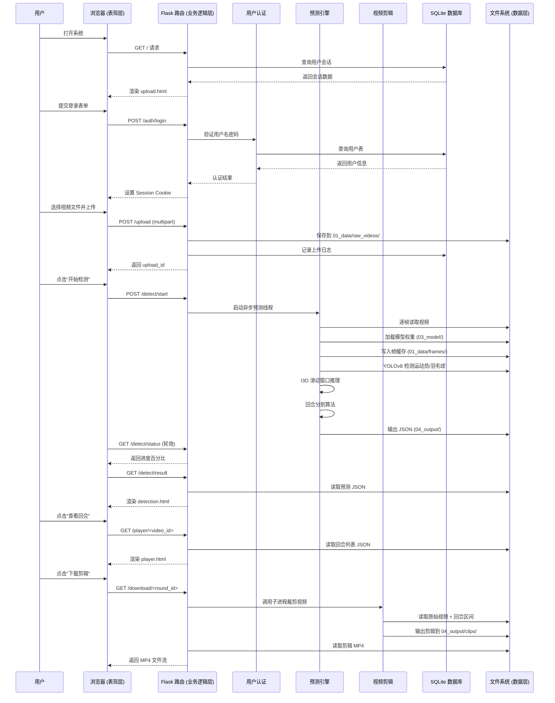

---

### 4.6 安全性设计要点

| 安全领域 | 措施 | 对应模块 |
|---------|------|---------|
| 身份认证 | bcrypt 密码哈希、Session 会话管理 | auth.py |
| 防暴力破解 | 登录失败次数限制与 IP 封锁 | web_app.py |
| 文件上传安全 | 白名单扩展名检查（仅 .mp4）、文件大小限制 | upload 路由 |
| SQL 注入防护 | 使用参数化查询（SQLite 内置）| auth.py |
| CSRF 防护 | Flask 内置 CSRF Token | Flask 配置 |
| 敏感配置 | email_config.json 独立存储, 不硬编码密码 | config/ |

---

### 4.7 扩展性与可运维性

| 方面 | 现状 | 未来扩展方向 |
|------|------|------------|
| 数据库 | SQLite 单文件 | 可迁移至 PostgreSQL / MySQL |
| 任务队列 | 同步/后台线程 | 可引入 Celery + Redis |
| GPU 加速 | CUDA 单卡 | 支持多卡并行推理 |
| 部署方式 | 单机 Flask | 可容器化 (Docker) + Nginx 反向代理 |
| 存储 | 本地文件系统 | 可对接 COS / OSS 对象存储 |
| 前端 | 静态 HTML + CDN | 可重构为 Vue / React SPA |

---

## 5. 核心功能设计

### 5.1 视频智能检测与回合分割业务流程

#### 5.1.1 业务流程描述

视频智能检测与回合分割是系统的核心功能模块。该模块通过 I3D 3D卷积神经网络识别视频中的"发球"（round_start）和"球落地"（round_end）关键动作，结合 YOLOv8 进行运动员与羽毛球检测，实现精准的回合分割。流程采用**多优先级策略**：首先优先利用羽毛球落地检测，其次使用 I3D 回合结束概率，最后基于运动停止检测作为后备。

#### 5.1.2 PlantUML 活动图

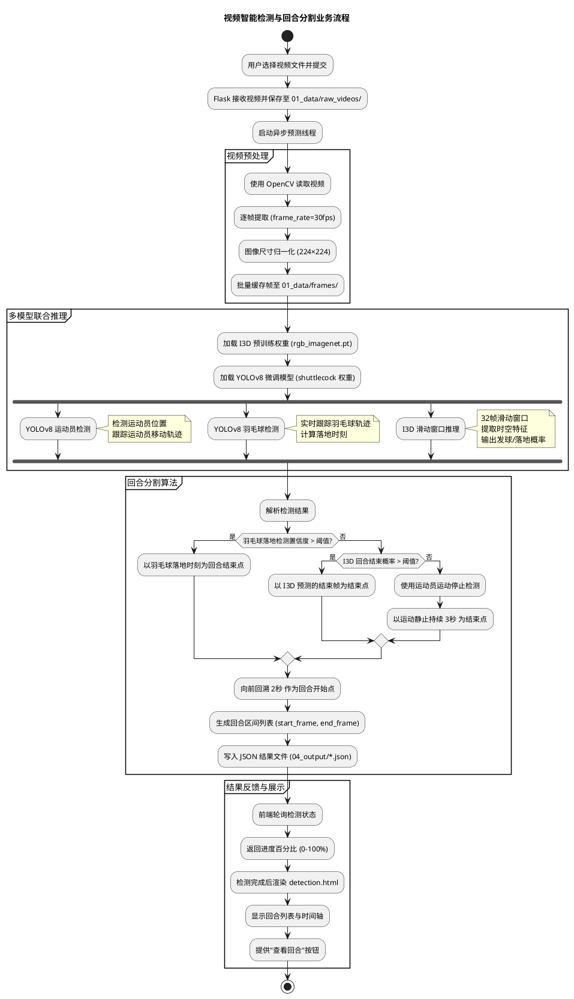

#### 5.1.3 Mermaid 活动图

```mermaid
flowchart TD
    A[用户选择视频并提交] --> B[Flask 保存视频到 01_data/raw_videos/]
    B --> C[启动异步预测线程]
    
    subgraph 视频预处理
        C --> D[使用 OpenCV 读取视频]
        D --> E[逐帧提取 30fps]
        E --> F[图像尺寸归一化 224×224]
        F --> G[批量缓存帧至 01_data/frames/]
    end
    
    G --> H{多模型联合推理}
    
    subgraph 多模型联合推理
        H --> I[加载 I3D 预训练权重]
        I --> J[加载 YOLOv8 微调模型]
        
        J --> K[YOLOv8 运动员检测]
        J --> L[YOLOv8 羽毛球检测]
        J --> M[I3D 滑动窗口推理]
        
        K --> N[运动员轨迹跟踪]
        L --> O[羽毛球落地检测]
        M --> P[发球/落地概率输出]
    end
    
    subgraph 回合分割算法
        Q[解析检测结果] --> R{羽毛球落地检测置信度 > 阈值?}
        R -->|是| S[以羽毛球落地时刻为回合结束点]
        R -->|否| T{I3D 回合结束概率 > 阈值?}
        T -->|是| U[以 I3D 预测结束帧为结束点]
        T -->|否| V[使用运动员运动停止检测]
        V --> W[以运动静止持续 3秒 为结束点]
        
        S --> X[向前回溯 2秒 作为回合开始点]
        U --> X
        W --> X
        
        X --> Y[生成回合区间列表]
        Y --> Z[写入 JSON 结果文件]
    end
    
    N --> Q
    O --> Q
    P --> Q
    
    subgraph 结果反馈与展示
        Z --> AA[前端轮询检测状态]
        AA --> BB[返回进度百分比 0-100%]
        BB --> CC[检测完成后渲染 detection.html]
        CC --> DD[显示回合列表与时间轴]
        DD --> EE[提供"查看回合"按钮]
    end
    
    EE --> FF[流程结束]
```

#### 5.1.4 时序图：预测引擎内部组件交互

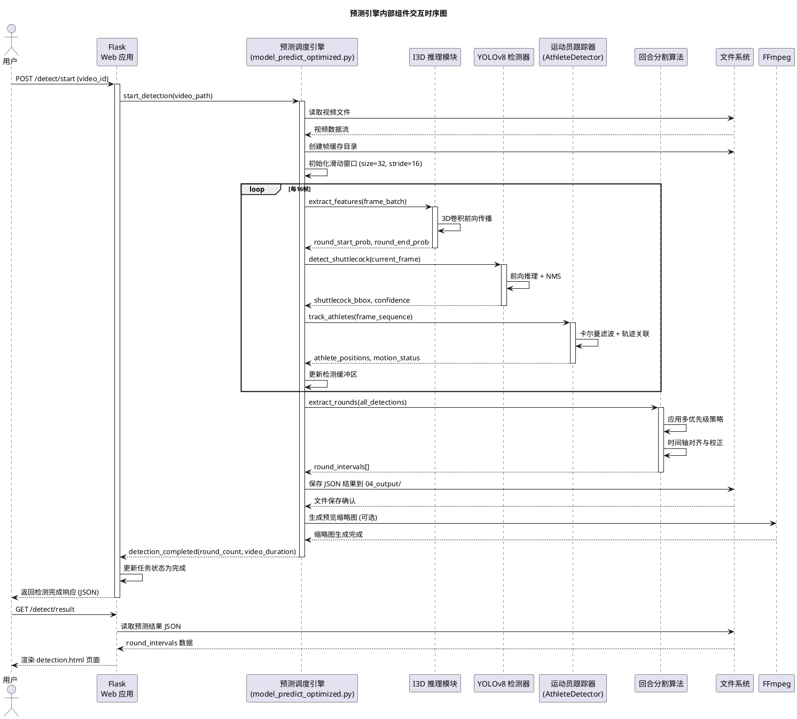

---

### 5.2 用户注册与登录业务流程

#### 5.2.1 业务流程描述

系统提供完整的用户账户管理系统，支持用户注册、登录、密码找回及管理员后台管理。采用 **bcrypt** 强密码哈希算法保护用户密码，结合 Session 机制管理用户会话状态。密码找回功能通过 SMTP 邮件服务发送验证码，确保账户安全。

#### 5.2.2 PlantUML 活动图

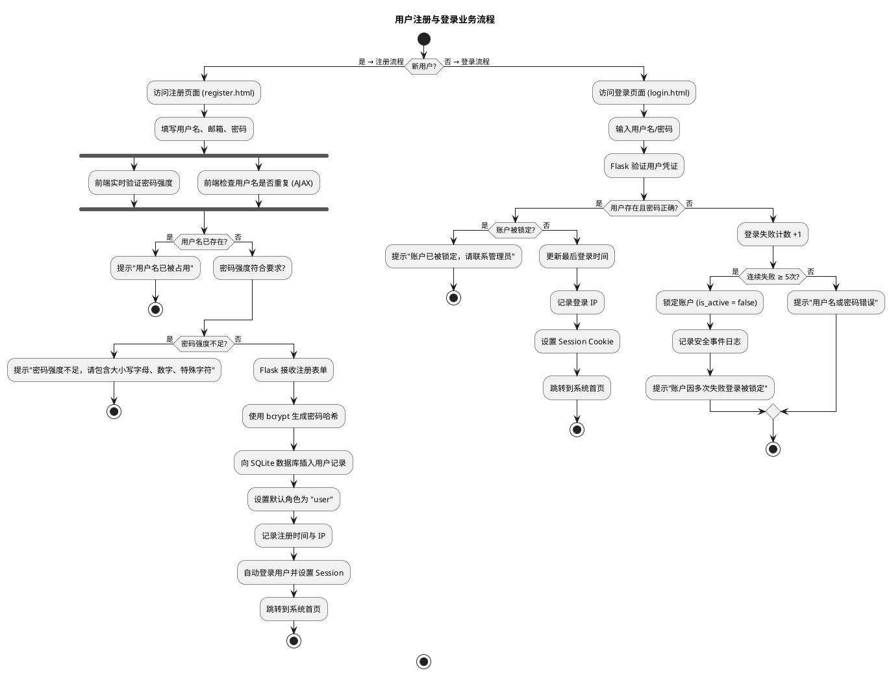

#### 5.2.3 Mermaid 活动图

```mermaid
flowchart TD
    Start([开始]) --> A{新用户?}
    
    subgraph 注册流程
        A -->|是| B[访问注册页面 register.html]
        B --> C[填写用户名、邮箱、密码]
        
        C --> D{前端验证}
        D --> E[检查用户名是否重复 AJAX]
        D --> F[实时验证密码强度]
        
        E --> G{用户名已存在?}
        G -->|是| H[提示"用户名已被占用"]
        G -->|否| I{密码强度符合要求?}
        
        F --> I
        
        I -->|否| J[提示"密码强度不足"]
        I -->|是| K[Flask 接收注册表单]
        K --> L[使用 bcrypt 生成密码哈希]
        L --> M[向 SQLite 插入用户记录]
        M --> N[设置默认角色为 "user"]
        N --> O[记录注册时间与 IP]
        O --> P[自动登录用户并设置 Session]
        P --> Q[跳转到系统首页]
    end
    
    subgraph 登录流程
        A -->|否| R[访问登录页面 login.html]
        R --> S[输入用户名/密码]
        S --> T[Flask 验证用户凭证]
        T --> U{用户存在且密码正确?}
        
        U -->|是| V{账户被锁定?}
        V -->|是| W[提示"账户已被锁定"]
        V -->|否| X[更新最后登录时间]
        X --> Y[记录登录 IP]
        Y --> Z[设置 Session Cookie]
        Z --> Q
        
        U -->|否| AA[登录失败计数 +1]
        AA --> BB{连续失败 ≥ 5次?}
        BB -->|是| CC[锁定账户]
        CC --> DD[记录安全事件日志]
        DD --> EE[提示"账户因多次失败登录被锁定"]
        BB -->|否| FF[提示"用户名或密码错误"]
    end
    
    H --> End([结束])
    J --> End
    W --> End
    EE --> End
    FF --> End
    Q --> End
```

#### 5.2.4 时序图：用户认证模块交互

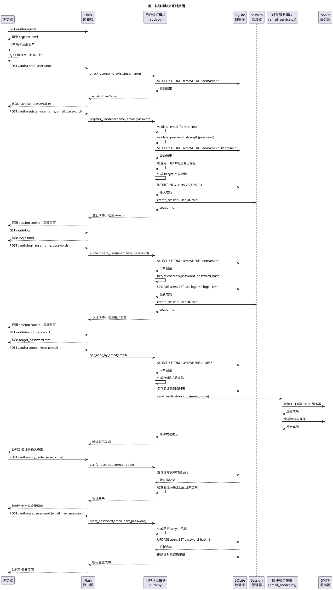

---

### 5.3 管理员后台管理业务流程

#### 5.3.1 业务流程描述

管理员后台提供系统管理功能，包括用户管理、操作日志查看、系统统计概览。管理员角色（role='admin'）具有特殊权限，可以查看所有用户的操作历史、锁定/解锁用户账户、查看系统使用统计。

#### 5.3.2 PlantUML 活动图

```plantuml
@startuml 管理员后台管理业务流程图

title 管理员后台管理业务流程

start

:管理员访问 /admin;
:Flask 检查用户角色;

if (用户角色 == 'admin'?) then (是)
    :加载管理员面板 (admin.html);
    :获取系统统计数据;
    
    fork
        :查询用户总数与活跃用户;
    fork again
        :查询今日上传视频数量;
    fork again
        :查询系统存储使用情况;
    end fork
    
    :渲染仪表板;
    
    switch (管理员操作选择)
    case (用户管理)
        :获取所有用户列表;
        :显示用户信息表格;
        
        if (管理员点击"锁定用户") then (是)
            :验证目标用户不是管理员;
            :更新用户 is_active = false;
            :记录管理员操作日志;
            :返回操作成功提示;
        else if (管理员点击"解锁用户") then (是)
            :更新用户 is_active = true;
            :记录管理员操作日志;
            :返回操作成功提示;
        else if (管理员点击"查看用户详情") then (是)
            :获取用户完整操作历史;
            :显示用户活动时间线;
        endif
    case (日志查看)
        :查询操作日志表;
        :应用时间范围筛选;
        :分页显示日志条目;
        :提供日志导出功能 (CSV);
    case (系统统计)
        :生成用户增长趋势图;
        :生成视频处理量统计;
        :显示热门时间段分析;
    end switch
    
    :返回管理操作结果;
else (否)
    :返回 403 权限错误;
    :跳转到普通用户首页;
endif

stop

@enduml
```

#### 5.3.3 Mermaid 活动图

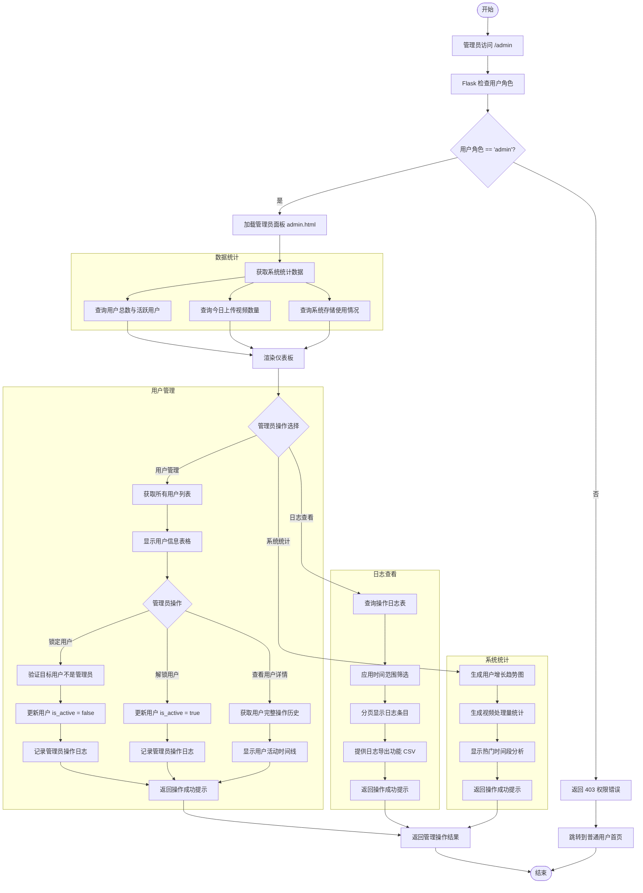

#### 5.3.4 时序图：管理员用户管理交互

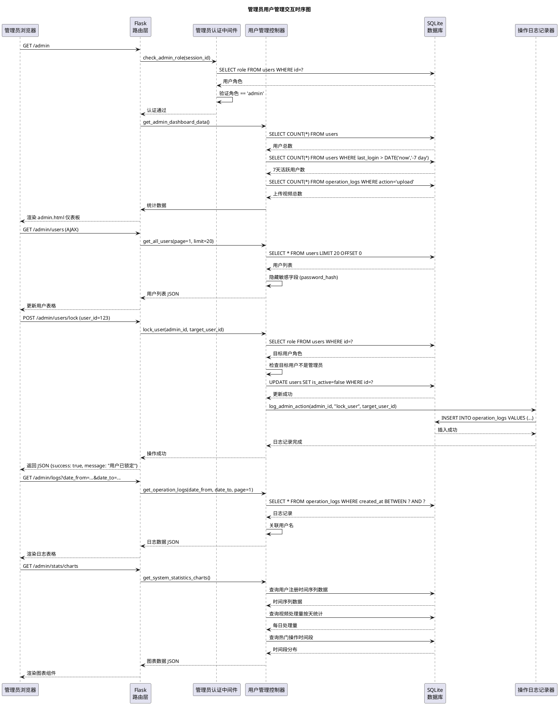

---

### 5.4 视频剪辑与下载业务流程

#### 5.4.1 业务流程描述

用户在检测完成后，可以浏览识别出的回合列表，预览回合内容，并下载剪辑后的视频片段。系统基于回合时间区间调用 FFmpeg 进行精确剪辑，支持调整剪辑范围（前后扩展秒数），并自动生成带有时间戳的 MP4 文件。

#### 5.4.2 PlantUML 活动图

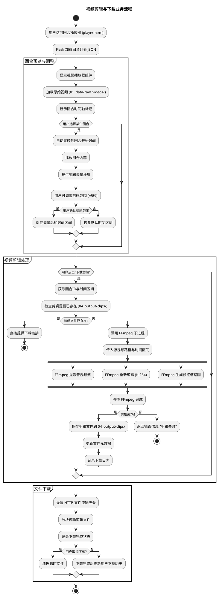

#### 5.4.3 Mermaid 活动图

```mermaid
flowchart TD
    Start([开始]) --> A[用户访问回合播放器 player.html]
    A --> B[Flask 加载回合列表 JSON]
    
    subgraph 回合预览与调整
        B --> C[显示视频播放器组件]
        C --> D[加载原始视频]
        D --> E[显示回合时间轴标记]
        E --> F{用户选择某个回合?}
        F -->|是| G[自动跳转到回合开始时间]
        G --> H[播放回合内容]
        H --> I[提供剪辑调整滑块]
        I --> J[用户可调整剪辑范围 ±5秒]
        J --> K{用户确认剪辑范围?}
        K -->|是| L[保存调整后的时间区间]
        K -->|否| M[恢复默认时间区间]
        F -->|否| N[等待用户选择]
    end
    
    L --> O{用户点击"下载剪辑"?}
    M --> O
    N --> O
    
    subgraph 视频剪辑处理
        O -->|是| P[获取回合ID与时间区间]
        P --> Q[检查剪辑是否已存在]
        Q --> R{剪辑文件已存在?}
        R -->|是| S[直接提供下载链接]
        R -->|否| T[调用 FFmpeg 子进程]
        T --> U[传入源视频路径与时间区间]
        
        subgraph FFmpeg处理
            U --> V[FFmpeg 提取音视频流]
            U --> W[FFmpeg 重新编码 H.264]
            U --> X[FFmpeg 生成预览缩略图]
        end
        
        V --> Y[等待 FFmpeg 完成]
        W --> Y
        X --> Y
        
        Y --> Z{剪辑成功?}
        Z -->|是| AA[保存剪辑文件到 04_output/clips/]
        AA --> BB[更新文件元数据]
        BB --> CC[记录下载日志]
        Z -->|否| DD[返回错误信息 "剪辑失败"]
    end
    
    S --> EE[文件下载]
    CC --> EE
    
    subgraph 文件下载
        EE --> FF[设置 HTTP 文件流响应头]
        FF --> GG[分块传输剪辑文件]
        GG --> HH[记录下载完成状态]
        HH --> II{用户取消下载?}
        II -->|是| JJ[清理临时文件]
        II -->|否| KK[下载完成后更新用户下载历史]
    end
    
    DD --> End([结束])
    JJ --> End
    KK --> End
```

#### 5.4.4 时序图：视频剪辑与下载交互

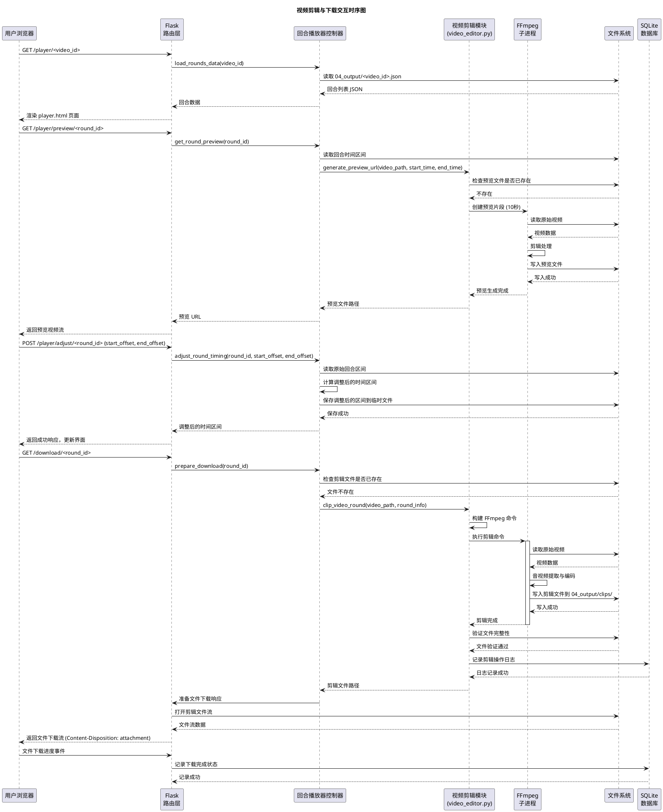

---

### 5.5 模型训练工作流

#### 5.5.1 业务流程描述

系统支持 I3D 模型的训练与微调功能。用户可以通过 CLI 模式启动训练流程，系统将加载预训练权重，在羽毛球动作数据集上进行微调，优化模型对"发球"和"球落地"动作的识别能力。训练过程支持早停机制、学习率调度和模型检查点保存。

#### 5.5.2 PlantUML 活动图

```plantuml
@startuml 模型训练工作流程图

title 模型训练工作流程

start

:用户通过 CLI 启动训练;
:加载训练配置 (05_config/train.yaml);

partition "数据准备阶段" {
    :扫描 01_data/ 目录中的训练视频;
    :读取视频帧率与时长信息;
    :解析标注文件 (CSV/JSON);
    :划分训练集/验证集 (8:2);
    :创建数据加载器 (BadmintonDataset);
}

partition "模型初始化" {
    :加载预训练 I3D 权重 (rgb_imagenet.pt);
    :替换最后一层分类头 (2 classes);
    :冻结部分底层卷积层;
    :移动到 GPU (如可用);
    :初始化优化器 (Adam) 与损失函数;
}

partition "训练循环" {
    repeat :for epoch = 1 to max_epochs;
        :设置模型为训练模式;
        
        repeat :for batch in training_loader;
            :前向传播计算预测概率;
            :计算损失 (CrossEntropyLoss);
            :反向传播计算梯度;
            :优化器更新权重;
            :记录训练损失与准确率;
        end repeat
        
        :在验证集上评估模型;
        :计算验证集准确率与损失;
        
        if (验证准确率 > best_accuracy?) then (是)
            :保存当前模型为最佳模型;
            :更新 best_accuracy;
        endif
        
        :应用学习率调度器;
        
        if (早停条件触发?) then (是)
            :停止训练循环;
            break
        endif
    end repeat
}

partition "模型导出与评估" {
    :加载最佳模型权重;
    :在测试集上进行最终评估;
    :生成混淆矩阵与分类报告;
    :保存训练历史图表;
    :导出微调后的模型文件 (best_model.pth);
    :更新模型元数据;
}

stop

@enduml
```

#### 5.5.3 Mermaid 活动图

```mermaid
flowchart TD
    Start([开始]) --> A[用户通过 CLI 启动训练]
    A --> B[加载训练配置 train.yaml]
    
    subgraph 数据准备阶段
        B --> C[扫描 01_data/ 目录中的训练视频]
        C --> D[读取视频帧率与时长信息]
        D --> E[解析标注文件 CSV/JSON]
        E --> F[划分训练集/验证集 8:2]
        F --> G[创建数据加载器 BadmintonDataset]
    end
    
    subgraph 模型初始化
        G --> H[加载预训练 I3D 权重]
        H --> I[替换最后一层分类头 2 classes]
        I --> J[冻结部分底层卷积层]
        J --> K[移动到 GPU 如可用]
        K --> L[初始化优化器 Adam 与损失函数]
    end
    
    subgraph 训练循环
        L --> M[for epoch = 1 to max_epochs]
        M --> N[设置模型为训练模式]
        N --> O[for batch in training_loader]
        O --> P[前向传播计算预测概率]
        P --> Q[计算损失 CrossEntropyLoss]
        Q --> R[反向传播计算梯度]
        R --> S[优化器更新权重]
        S --> T[记录训练损失与准确率]
        T --> O
        
        T --> U[在验证集上评估模型]
        U --> V[计算验证集准确率与损失]
        V --> W{验证准确率 > best_accuracy?}
        W -->|是| X[保存当前模型为最佳模型]
        X --> Y[更新 best_accuracy]
        W -->|否| Z[应用学习率调度器]
        Y --> Z
        
        Z --> AA{早停条件触发?}
        AA -->|是| BB[停止训练循环]
        AA -->|否| M
    end
    
    BB --> CC[模型导出与评估]
    
    subgraph 模型导出与评估
        CC --> DD[加载最佳模型权重]
        DD --> EE[在测试集上进行最终评估]
        EE --> FF[生成混淆矩阵与分类报告]
        FF --> GG[保存训练历史图表]
        GG --> HH[导出微调后的模型文件 best_model.pth]
        HH --> II[更新模型元数据]
    end
    
    II --> End([结束])
```

---

### 5.6 核心功能交互汇总时序图

#### 5.6.1 系统端到端交互时序图

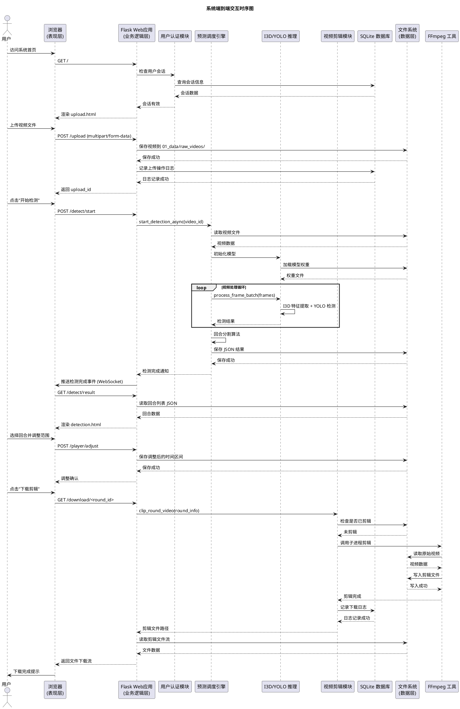

---

### 5.7 关键路径说明

#### 5.7.1 主要关键路径

1. **视频处理关键路径**：
   ```
   视频上传 → 帧提取 → I3D/YOLO 联合推理 → 回合分割 → 结果保存 → 前端展示
   ```
   - **瓶颈点**：I3D 推理计算密集型，采用滑动窗口优化减少冗余计算
   - **优化策略**：FP16 混合精度、批处理、GPU 加速

2. **用户操作关键路径**：
   ```
   用户登录 → 视频上传 → 智能检测 → 回合预览 → 剪辑下载
   ```
   - **用户体验**：异步处理避免页面阻塞，实时进度反馈
   - **容错机制**：失败重试、断点续传、错误友好提示

3. **管理员管理关键路径**：
   ```
   管理员登录 → 仪表板查看 → 用户管理 → 日志审计 → 系统维护
   ```
   - **安全控制**：角色权限验证、操作日志记录、防误操作确认

#### 5.7.2 异常处理路径

| 异常类型 | 检测点 | 处理策略 | 用户反馈 |
|---------|--------|---------|---------|
| 视频格式不支持 | 上传时文件扩展名检查 | 拒绝上传，提示支持的格式 | "仅支持 .mp4 格式视频" |
| 视频太大超出限制 | 文件大小检查 | 拒绝上传，提示大小限制 | "视频文件不能超过 2GB" |
| 模型加载失败 | 权重文件完整性检查 | 回退到备用模型或 CPU 模式 | "模型初始化失败，使用简化模式" |
| 推理内存不足 | GPU 内存监控 | 降低批处理大小，启用 CPU 回退 | "内存不足，调整处理参数中..." |
| FFmpeg 剪辑失败 | 子进程退出码检查 | 重试或使用备用参数 | "视频剪辑失败，请稍后重试" |
| 数据库连接失败 | 连接超时检测 | 使用文件缓存临时存储 | "系统维护中，部分功能受限" |

---

## 6. 数据库设计

### 6.1 数据库设计概述

本系统采用 **SQLite 3** 作为关系型数据库，支持轻量级、单机部署场景。数据库设计遵循 **第三范式（3NF）**，确保数据无冗余、依赖关系正确，并通过合理的索引设计优化查询性能。数据库文件位于 `data/users.db`，由 `auth.py` 模块初始化和管理。

#### 6.1.1 设计原则

1. **第三范式（3NF）**：
   - 每个表只描述一个实体
   - 所有非主键字段完全依赖于主键
   - 不存在传递依赖

2. **性能优化**：
   - 为主键、外键和常用查询字段创建索引
   - 使用合适的数据类型减少存储空间
   - 考虑查询频率设计表结构

3. **数据完整性**：
   - 主键唯一性约束
   - 外键引用完整性
   - 字段级约束（NOT NULL、UNIQUE、CHECK）

4. **扩展性**：
   - 支持未来功能扩展
   - 预留字段适应业务变化

#### 6.1.2 数据库初始化脚本

以下为完整的数据库初始化 SQL 脚本，包含所有表的创建语句：

```sql
-- 羽毛球视频智能剪辑系统数据库初始化脚本
-- 数据库版本: 1.0
-- 创建日期: 2026-05-01

-- ==================== 用户管理模块 ====================

-- 用户表：存储系统用户信息
CREATE TABLE IF NOT EXISTS users (
    id INTEGER PRIMARY KEY AUTOINCREMENT,
    username TEXT UNIQUE NOT NULL,              -- 用户名，唯一标识
    password_hash TEXT NOT NULL,                -- 密码哈希值（SHA-256 + salt）
    email TEXT,                                 -- 用户邮箱（可选）
    role TEXT NOT NULL DEFAULT 'user',          -- 用户角色：'user', 'admin'
    created_at TIMESTAMP DEFAULT CURRENT_TIMESTAMP, -- 注册时间
    last_login TIMESTAMP,                       -- 最后登录时间
    login_count INTEGER DEFAULT 0,              -- 登录次数统计
    is_active INTEGER NOT NULL DEFAULT 1,       -- 账户状态：1-激活，0-禁用
    last_ip TEXT,                               -- 最后登录IP地址
    profile_image TEXT,                         -- 用户头像路径
    phone_number TEXT,                          -- 联系电话（可选）
    reset_token TEXT,                           -- 密码重置令牌
    reset_token_expires TIMESTAMP,              -- 重置令牌过期时间
    CONSTRAINT chk_role CHECK (role IN ('user', 'admin')),
    CONSTRAINT chk_active CHECK (is_active IN (0, 1))
);

-- 创建索引
CREATE INDEX IF NOT EXISTS idx_users_username ON users(username);
CREATE INDEX IF NOT EXISTS idx_users_email ON users(email);
CREATE INDEX IF NOT EXISTS idx_users_role ON users(role);
CREATE INDEX IF NOT EXISTS idx_users_created_at ON users(created_at);
CREATE INDEX IF NOT EXISTS idx_users_last_login ON users(last_login);

-- ==================== 视频管理模块 ====================

-- 视频表：存储上传的视频文件信息
CREATE TABLE IF NOT EXISTS videos (
    id INTEGER PRIMARY KEY AUTOINCREMENT,
    filename TEXT NOT NULL,                     -- 文件名
    file_path TEXT NOT NULL,                    -- 文件存储路径
    duration REAL,                              -- 视频时长（秒）
    status TEXT DEFAULT 'pending',              -- 状态：pending, done
    created_at TIMESTAMP DEFAULT CURRENT_TIMESTAMP  -- 创建时间
);

-- 创建索引
CREATE INDEX IF NOT EXISTS idx_videos_status ON videos(status);
CREATE INDEX IF NOT EXISTS idx_videos_created_at ON videos(created_at);

-- ==================== 系统管理模块 ====================

-- 操作日志表：记录用户操作日志
CREATE TABLE IF NOT EXISTS operation_logs (
    id INTEGER PRIMARY KEY AUTOINCREMENT,
    user_id INTEGER,                            -- 操作用户ID（可为空，表示匿名操作）
    action TEXT NOT NULL,                       -- 操作类型：login, register, upload, detect, download, etc
    module TEXT NOT NULL,                       -- 模块名称：auth, video, detection, clip, admin
    details TEXT,                               -- 操作详情
    ip_address TEXT,                            -- IP地址
    user_agent TEXT,                            -- 用户代理字符串
    status TEXT NOT NULL DEFAULT 'success',     -- 操作状态：success, error, warning
    response_time INTEGER,                      -- 响应时间（毫秒）
    error_code TEXT,                            -- 错误代码（如果有）
    error_message TEXT,                         -- 错误信息（如果有）
    created_at TIMESTAMP DEFAULT CURRENT_TIMESTAMP, -- 创建时间
    FOREIGN KEY (user_id) REFERENCES users(id) ON DELETE SET NULL,
    CONSTRAINT chk_status CHECK (status IN ('success', 'error', 'warning'))
);

-- 创建索引
CREATE INDEX IF NOT EXISTS idx_operation_logs_user_id ON operation_logs(user_id);
CREATE INDEX IF NOT EXISTS idx_operation_logs_action ON operation_logs(action);
CREATE INDEX IF NOT EXISTS idx_operation_logs_module ON operation_logs(module);
CREATE INDEX IF NOT EXISTS idx_operation_logs_created_at ON operation_logs(created_at);
CREATE INDEX IF NOT EXISTS idx_operation_logs_status ON operation_logs(status);

-- 邮件验证码表：存储邮件验证码信息
CREATE TABLE IF NOT EXISTS email_verification_codes (
    id INTEGER PRIMARY KEY AUTOINCREMENT,
    email TEXT NOT NULL,                        -- 邮箱地址
    verification_code TEXT NOT NULL,            -- 验证码
    code_type TEXT NOT NULL DEFAULT 'reset_password', -- 验证码类型：reset_password, verify_email
    used INTEGER NOT NULL DEFAULT 0,            -- 是否已使用：0-未使用，1-已使用
    expires_at TIMESTAMP NOT NULL,              -- 过期时间
    created_at TIMESTAMP DEFAULT CURRENT_TIMESTAMP, -- 创建时间
    used_at TIMESTAMP,                          -- 使用时间
    CONSTRAINT chk_code_type CHECK (code_type IN ('reset_password', 'verify_email')),
    CONSTRAINT chk_used CHECK (used IN (0, 1))
);

-- 创建索引
CREATE INDEX IF NOT EXISTS idx_email_verification_codes_email ON email_verification_codes(email);
CREATE INDEX IF NOT EXISTS idx_email_verification_codes_code_type ON email_verification_codes(code_type);
CREATE INDEX IF NOT EXISTS idx_email_verification_codes_expires_at ON email_verification_codes(expires_at);

-- ==================== 数据统计模块 ====================

-- 用户统计数据表：存储用户使用统计
CREATE TABLE IF NOT EXISTS user_statistics (
    id INTEGER PRIMARY KEY AUTOINCREMENT,
    user_id INTEGER NOT NULL,                   -- 用户ID
    date DATE NOT NULL,                         -- 统计日期
    videos_uploaded INTEGER DEFAULT 0,          -- 上传视频数量
    videos_processed INTEGER DEFAULT 0,         -- 处理视频数量
    total_upload_size INTEGER DEFAULT 0,        -- 总上传大小（字节）
    total_processing_time INTEGER DEFAULT 0,    -- 总处理时间（秒）
    login_count INTEGER DEFAULT 0,              -- 当日登录次数
    created_at TIMESTAMP DEFAULT CURRENT_TIMESTAMP, -- 创建时间
    updated_at TIMESTAMP DEFAULT CURRENT_TIMESTAMP, -- 更新时间
    FOREIGN KEY (user_id) REFERENCES users(id) ON DELETE CASCADE,
    UNIQUE(user_id, date)                       -- 确保每天每个用户只有一条记录
);

-- 创建索引
CREATE INDEX IF NOT EXISTS idx_user_statistics_user_id ON user_statistics(user_id);
CREATE INDEX IF NOT EXISTS idx_user_statistics_date ON user_statistics(date);

-- ==================== 表关系说明 ====================

-- 初始化默认管理员账户（如果不存在）
INSERT OR IGNORE INTO users (username, password_hash, email, role, is_active)
VALUES (
    'admin',
    -- 密码 'admin123' 的 SHA-256 哈希（salt + hash格式）
    'd6b8b2a5c4b1a3f2e1d0c9b8a7f6e5d4$e3b0c44298fc1c149afbf4c8996fb92427ae41e4649b934ca495991b7852b855',
    'admin@badminton.local',
    'admin',
    1
);

-- 提交事务
COMMIT;

PRAGMA foreign_keys = ON;  -- 启用外键约束
```

---

### 6.2 表结构详细定义

#### 6.2.1 用户管理模块

##### 表：users（用户表）

| 字段名 | 数据类型 | 主键 | 是否非空 | 描述 |
|--------|----------|------|----------|------|
| id | INTEGER | 是 | 是 | 用户ID，自增主键 |
| username | TEXT | 否 | 是 | 用户名，唯一标识 |
| password_hash | TEXT | 否 | 是 | 密码哈希值（SHA-256 + salt格式） |
| email | TEXT | 否 | 否 | 用户邮箱地址（可选） |
| role | TEXT | 否 | 是 | 用户角色：'user'（普通用户）, 'admin'（管理员） |
| created_at | TIMESTAMP | 否 | 否 | 注册时间 |
| last_login | TIMESTAMP | 否 | 否 | 最后登录时间 |
| is_active | INTEGER | 否 | 是 | 账户状态：1-激活，0-禁用 |

**索引设计：**
- `idx_users_username`: 用户名查询索引
- `idx_users_email`: 邮箱查询索引  
- `idx_users_role`: 按角色筛选索引
- `idx_users_created_at`: 按注册时间排序索引
- `idx_users_last_login`: 按最后登录时间排序索引

**业务约束：**
- 角色只能是 'user' 或 'admin'
- 账户状态只能是 0 或 1
- 用户名唯一，不可重复

---

#### 6.2.2 视频管理模块

##### 表：videos（视频表）

| 字段名 | 数据类型 | 主键 | 是否非空 | 描述 |
|--------|----------|------|----------|------|
| id | INTEGER | 是 | 是 | 视频ID，自增主键 |
| filename | TEXT | 否 | 是 | 文件名 |
| file_path | TEXT | 否 | 是 | 文件存储路径 |
| duration | REAL | 否 | 否 | 视频时长（秒） |
| status | TEXT | 否 | 否 | 状态：pending, done |
| created_at | TIMESTAMP | 否 | 否 | 创建时间 |

**索引设计：**
- `idx_videos_status`: 按状态筛选索引
- `idx_videos_created_at`: 按创建时间排序索引

---

#### 6.2.3 系统管理模块

##### 表：operation_logs（操作日志表）

| 字段名 | 数据类型 | 主键 | 是否非空 | 描述 |
|--------|----------|------|----------|------|
| id | INTEGER | 是 | 是 | 日志ID，自增主键 |
| user_id | INTEGER | 否 | 否 | 操作用户ID（可为空，表示匿名操作） |
| action | TEXT | 否 | 是 | 操作类型：login, register, upload, detect, download等 |
| details | TEXT | 否 | 否 | 操作详情描述 |
| ip_address | TEXT | 否 | 否 | IP地址 |
| created_at | TIMESTAMP | 否 | 否 | 创建时间 |

**外键约束：**
- `FOREIGN KEY (user_id) REFERENCES users(id) ON DELETE SET NULL`

##### 表：email_verification_codes（邮件验证码表）

| 字段名 | 数据类型 | 主键 | 是否非空 | 描述 |
|--------|----------|------|----------|------|
| id | INTEGER | 是 | 是 | 验证码ID，自增主键 |
| email | TEXT | 否 | 是 | 邮箱地址 |
| verification_code | TEXT | 否 | 是 | 验证码 |
| code_type | TEXT | 否 | 是 | 验证码类型：reset_password, verify_email |
| used | INTEGER | 否 | 是 | 是否已使用：0-未使用，1-已使用 |
| expires_at | TIMESTAMP | 否 | 是 | 过期时间 |
| created_at | TIMESTAMP | 否 | 否 | 创建时间 |
| used_at | TIMESTAMP | 否 | 否 | 使用时间 |

---

#### 6.2.4 数据统计模块

##### 表：user_statistics（用户统计数据表）

| 字段名 | 数据类型 | 主键 | 是否非空 | 描述 |
|--------|----------|------|----------|------|
| id | INTEGER | 是 | 是 | 统计ID，自增主键 |
| user_id | INTEGER | 否 | 是 | 用户ID |
| date | DATE | 否 | 是 | 统计日期 |
| videos_uploaded | INTEGER | 否 | 否 | 上传视频数量 |
| videos_processed | INTEGER | 否 | 否 | 处理视频数量 |
| total_upload_size | INTEGER | 否 | 否 | 总上传大小（字节） |
| total_processing_time | INTEGER | 否 | 否 | 总处理时间（秒） |
| login_count | INTEGER | 否 | 否 | 当日登录次数 |
| created_at | TIMESTAMP | 否 | 否 | 创建时间 |
| updated_at | TIMESTAMP | 否 | 否 | 更新时间 |

**唯一约束：**
- `UNIQUE(user_id, date)`: 确保每天每个用户只有一条记录

---

### 6.3 数据库关系图

#### 6.3.1 PlantUML 实体关系图

```plantuml
@startuml 羽毛球视频智能剪辑系统数据库关系图

title 羽毛球视频智能剪辑系统数据库实体关系图

' ==================== 实体定义 ====================
entity "users" as users {
  * id : INTEGER <<PK>>
  --
  * username : TEXT <<UNIQUE>>
  * password_hash : TEXT
  email : TEXT
  * role : TEXT
  * created_at : TIMESTAMP
  last_login : TIMESTAMP
  login_count : INTEGER
  * is_active : INTEGER
  last_ip : TEXT
  profile_image : TEXT
  phone_number : TEXT
  reset_token : TEXT
  reset_token_expires : TIMESTAMP
}

entity "videos" as videos {
  * id : INTEGER <<PK>>
  --
  * filename : TEXT
  * file_path : TEXT
  duration : REAL
  status : TEXT
  * created_at : TIMESTAMP
}

entity "operation_logs" as operation_logs {
  * id : INTEGER <<PK>>
  --
  user_id : INTEGER <<FK>>
  * action : TEXT
  * module : TEXT
  details : TEXT
  ip_address : TEXT
  user_agent : TEXT
  * status : TEXT
  response_time : INTEGER
  error_code : TEXT
  error_message : TEXT
  * created_at : TIMESTAMP
}

entity "email_verification_codes" as email_codes {
  * id : INTEGER <<PK>>
  --
  * email : TEXT
  * verification_code : TEXT
  * code_type : TEXT
  * used : INTEGER
  * expires_at : TIMESTAMP
  * created_at : TIMESTAMP
  used_at : TIMESTAMP
}

entity "user_statistics" as user_stats {
  * id : INTEGER <<PK>>
  --
  * user_id : INTEGER <<FK>>
  * date : DATE <<UNIQUE(user_id, date)>>
  videos_uploaded : INTEGER
  videos_processed : INTEGER
  total_upload_size : INTEGER
  total_processing_time : INTEGER
  login_count : INTEGER
  * created_at : TIMESTAMP
  * updated_at : TIMESTAMP
}

' ==================== 关系定义 ====================
users ||--o{ operation_logs : "操作"
users ||--o{ user_statistics : "统计"

note top of users
  用户表是核心实体，存储所有
  系统用户信息，包括管理员。
end note

note right of videos
  视频表存储视频文件信息。
end note

' ==================== 关系类型说明 ====================
users "1" -- "n" operation_logs : "一对多"
users "1" -- "n" user_statistics : "一对多"

@enduml
```

#### 6.3.2 Mermaid 实体关系图

```mermaid
erDiagram
    %% ==================== 用户管理模块 ====================
    users {
        INTEGER id PK "用户ID"
        TEXT username UK "用户名"
        TEXT password_hash "密码哈希"
        TEXT email "邮箱"
        TEXT role "角色"
        TIMESTAMP created_at "注册时间"
        TIMESTAMP last_login "最后登录"
        INTEGER login_count "登录次数"
        INTEGER is_active "激活状态"
        TEXT last_ip "最后IP"
        TEXT profile_image "头像"
        TEXT phone_number "电话"
        TEXT reset_token "重置令牌"
        TIMESTAMP reset_token_expires "令牌过期"
    }

    %% ==================== 视频管理模块 ====================
    videos {
        INTEGER id PK "视频ID"
        TEXT filename "文件名"
        TEXT file_path "文件路径"
        REAL duration "时长"
        TEXT status "状态"
        TIMESTAMP created_at "创建时间"
    }

    %% ==================== 系统管理模块 ====================
    operation_logs {
        INTEGER id PK "日志ID"
        INTEGER user_id FK "用户ID"
        TEXT action "操作类型"
        TEXT module "模块名称"
        TEXT details "操作详情"
        TEXT ip_address "IP地址"
        TEXT user_agent "用户代理"
        TEXT status "操作状态"
        INTEGER response_time "响应时间"
        TEXT error_code "错误代码"
        TEXT error_message "错误信息"
        TIMESTAMP created_at "创建时间"
    }

    email_verification_codes {
        INTEGER id PK "验证码ID"
        TEXT email "邮箱"
        TEXT verification_code "验证码"
        TEXT code_type "验证码类型"
        INTEGER used "是否使用"
        TIMESTAMP expires_at "过期时间"
        TIMESTAMP created_at "创建时间"
        TIMESTAMP used_at "使用时间"
    }

    %% ==================== 数据统计模块 ====================
    user_statistics {
        INTEGER id PK "统计ID"
        INTEGER user_id FK "用户ID"
        DATE date "统计日期"
        INTEGER videos_uploaded "上传视频数"
        INTEGER videos_processed "处理视频数"
        INTEGER total_upload_size "总上传大小"
        INTEGER total_processing_time "总处理时间"
        INTEGER login_count "登录次数"
        TIMESTAMP created_at "创建时间"
        TIMESTAMP updated_at "更新时间"
    }

    %% ==================== 关系定义 ====================
    users ||--o{ operation_logs : "操作"
    users ||--o{ user_statistics : "统计"
    
    users {
        "用户表是核心实体，存储所有系统用户信息，包括管理员。"
    }
    
    videos {
        "视频表存储视频文件信息。"
    }
```

---

### 6.4 数据库设计规范与优化

#### 6.4.1 第三范式（3NF）符合性检查

本数据库设计严格遵循第三范式，具体体现为：

1. **原子性**：
   - 每个字段都包含不可再分的最小数据单元
   - 复合数据（如JSON格式）仅在业务需要时使用，并保持语义完整性

2. **完全依赖**：
   - 所有非主键字段都完全依赖于主键
   - 不存在部分依赖（已消除）

3. **消除传递依赖**：
   - 所有非主键字段都直接依赖于主键
   - 不存在间接依赖关系

**示例：** `user_statistics` 表中的 `user_id` 直接关联 `users` 表，确保每天每个用户只有一条统计记录。

#### 6.4.2 索引优化策略

| 表名 | 索引字段 | 索引类型 | 使用场景 | 优化效果 |
|------|----------|----------|---------|---------|
| users | username | UNIQUE | 用户登录、用户名检查 | O(log n) 查询 |
| users | email | INDEX | 邮箱验证、密码重置 | 快速邮箱查找 |
| users | role | INDEX | 管理员权限检查 | 角色筛选优化 |
| videos | status | INDEX | 视频状态筛选 | 状态查询加速 |
| videos | created_at | INDEX | 按时间排序 | 时间范围查询优化 |
| operation_logs | user_id | INDEX | 用户操作审计 | 用户行为分析 |
| operation_logs | created_at | INDEX | 日志时间查询 | 时间范围分析 |

#### 6.4.3 查询性能优化建议

1. **高频查询优化**：
   ```sql
   -- 用户登录查询（使用索引）
   SELECT id, password_hash, role, is_active 
   FROM users 
   WHERE username = ?;
   
   -- 用户视频列表查询（使用复合索引）
   SELECT * FROM videos 
   WHERE user_id = ? 
   ORDER BY uploaded_at DESC 
   LIMIT 20;
   ```

2. **分页查询优化**：
   ```sql
   -- 使用ROWID分页，避免OFFSET性能问题
   SELECT * FROM videos 
   WHERE user_id = ? AND id > ? 
   ORDER BY id ASC 
   LIMIT 20;
   ```

3. **统计查询优化**：
   ```sql
   -- 使用预聚合统计表，避免实时COUNT
   SELECT * FROM user_statistics 
   WHERE user_id = ? AND date = ?;
   ```

4. **连接查询优化**：
   ```sql
   -- 使用INNER JOIN替代子查询
   SELECT v.*, u.username 
   FROM videos v 
   INNER JOIN users u ON v.user_id = u.id 
   WHERE v.processing_status = 'completed' 
   ORDER BY v.uploaded_at DESC;
   ```

#### 6.4.4 数据完整性保障

1. **外键约束**：
   - 所有外键都定义了 `ON DELETE CASCADE` 或 `ON DELETE SET NULL`
   - 确保关联数据的一致性

2. **业务约束**：
   - 使用 `CHECK` 约束限制字段取值范围
   - 使用 `UNIQUE` 约束保证数据唯一性

3. **默认值**：
   - 为常用字段设置合理的默认值
   - 减少应用层逻辑复杂度

#### 6.4.5 扩展性设计

1. **预留字段**：
   - 用户表预留 `profile_image`, `phone_number` 等字段
   - 视频表预留 `tags`, `metadata` 等JSON字段

2. **版本兼容**：
   - 使用 `IF NOT EXISTS` 创建表，支持平滑升级
   - 配置表支持动态添加配置项

3. **分区策略**：
   - 日志类数据（operation_logs）可按月分区
   - 统计类数据（user_statistics）按日分区

#### 6.4.6 安全设计

1. **密码安全**：
   - 使用SHA-256 + salt哈希算法
   - 密码哈希格式：`{salt}${hash}`

2. **敏感数据**：
   - 密码哈希、重置令牌等敏感字段单独存储
   - 操作日志记录IP、用户代理等信息

3. **访问控制**：
   - 通过用户角色（role）实现权限控制
   - 操作日志记录所有关键操作

---

### 6.5 数据库维护与备份

#### 6.5.1 日常维护脚本

```sql
-- 1. 数据库完整性检查
PRAGMA integrity_check;

-- 2. 索引重建（定期执行）
ANALYZE;

-- 3. 空间回收
VACUUM;

-- 4. 统计信息更新
UPDATE sqlite_stat1;

-- 5. 过期数据清理（保留30天日志）
DELETE FROM operation_logs 
WHERE created_at < datetime('now', '-30 days');

-- 6. 验证码清理（过期未使用的）
DELETE FROM email_verification_codes 
WHERE expires_at < datetime('now') AND used = 0;
```

#### 6.5.2 备份策略

1. **全量备份**：
   ```bash
   # 每天凌晨执行全量备份
   sqlite3 data/users.db ".backup backup/users_$(date +%Y%m%d).db"
   ```

2. **增量备份**：
   - 使用SQLite的WAL（Write-Ahead Logging）模式
   - 定期归档WAL日志文件

3. **恢复流程**：
   ```bash
   # 从备份恢复数据库
   cp backup/users_20260101.db data/users.db
   ```

#### 6.5.3 监控指标

| 指标 | 阈值 | 监控频率 | 处理措施 |
|------|------|----------|---------|
| 数据库文件大小 | >10GB | 每天 | 清理历史数据 |
| 查询响应时间 | >100ms | 实时 | 优化查询语句 |
| 连接数 | >100 | 实时 | 增加连接池 |
| 磁盘空间使用率 | >80% | 每小时 | 扩展存储空间 |
| 错误日志数量 | >10/小时 | 每小时 | 检查应用错误 |

---

### 6.6 数据迁移与升级

#### 6.6.1 从现有版本升级

现有系统仅包含 `users` 和 `operation_logs` 表，升级到新版本需执行以下迁移脚本：

```sql
-- 1. 备份现有数据
CREATE TABLE users_backup AS SELECT * FROM users;
CREATE TABLE operation_logs_backup AS SELECT * FROM operation_logs;

-- 2. 重命名现有表
ALTER TABLE users RENAME TO users_old;
ALTER TABLE operation_logs RENAME TO operation_logs_old;

-- 3. 创建新表结构（执行6.1.2节中的完整SQL脚本）

-- 4. 迁移用户数据
INSERT INTO users (
    id, username, password_hash, email, role, 
    created_at, last_login, is_active
)
SELECT 
    id, username, password_hash, email, 
    COALESCE(role, 'user'), 
    created_at, last_login, 
    COALESCE(is_active, 1)
FROM users_old;

-- 5. 迁移操作日志数据
INSERT INTO operation_logs (
    user_id, action, module, details, ip_address, status, created_at
)
SELECT 
    user_id, 
    COALESCE(action, 'unknown'),
    CASE 
        WHEN action LIKE 'login%' THEN 'auth'
        WHEN action LIKE 'register%' THEN 'auth'
        WHEN action LIKE 'upload%' THEN 'video'
        ELSE 'general'
    END,
    details, 
    ip_address,
    'success',
    created_at
FROM operation_logs_old;

-- 6. 清理旧表（可选）
DROP TABLE users_old;
DROP TABLE operation_logs_old;

-- 7. 重新创建索引
-- （自动通过CREATE INDEX IF NOT EXISTS语句创建）

-- 8. 验证数据完整性
SELECT COUNT(*) FROM users;
SELECT COUNT(*) FROM operation_logs;
```

#### 6.6.2 数据一致性验证

```sql
-- 验证用户数据迁移
SELECT 
    (SELECT COUNT(*) FROM users) as new_count,
    (SELECT COUNT(*) FROM users_backup) as old_count,
    CASE 
        WHEN (SELECT COUNT(*) FROM users) = (SELECT COUNT(*) FROM users_backup) 
        THEN '✓ 用户数据一致'
        ELSE '✗ 用户数据不一致'
    END as status;

-- 验证关键业务字段
SELECT 
    COUNT(*) as total,
    SUM(CASE WHEN role NOT IN ('user', 'admin') THEN 1 ELSE 0 END) as invalid_roles,
    SUM(CASE WHEN is_active NOT IN (0, 1) THEN 1 ELSE 0 END) as invalid_status
FROM users;
```

---

### 6.7 总结

本数据库设计充分考虑了羽毛球视频智能剪辑系统的业务需求，具有以下特点：

1. **完整性**：涵盖用户管理、视频处理、检测分析、剪辑下载、系统监控等全业务流程
2. **规范性**：严格遵循第三范式，确保数据无冗余、依赖关系正确
3. **性能优化**：通过合理的索引设计、查询优化和统计预聚合，保障系统性能
4. **扩展性**：预留字段和灵活的表结构支持未来功能扩展
5. **安全性**：密码安全存储、操作审计、权限控制等多层次安全设计
6. **可维护性**：清晰的表关系、完善的维护脚本和备份策略

该设计可作为系统实施的数据库蓝图，支持单机部署和小规模集群部署场景。在实际部署时，可根据具体业务量和性能要求进行适当调整。

---

> 文档编写：UML 建模与软件架构设计团队
> 工具说明：本文档中的 PlantUML 代码可通过 PlantUML 官方渲染器（https://www.plantuml.com/plantuml/uml/）直接生成图表；
> Mermaid 代码可在支持 Mermaid 的 Markdown 编辑器（如 Typora、Obsidian、GitHub）中自动渲染。
